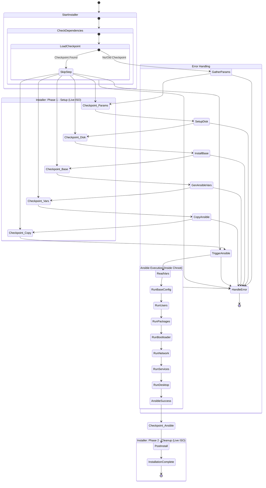
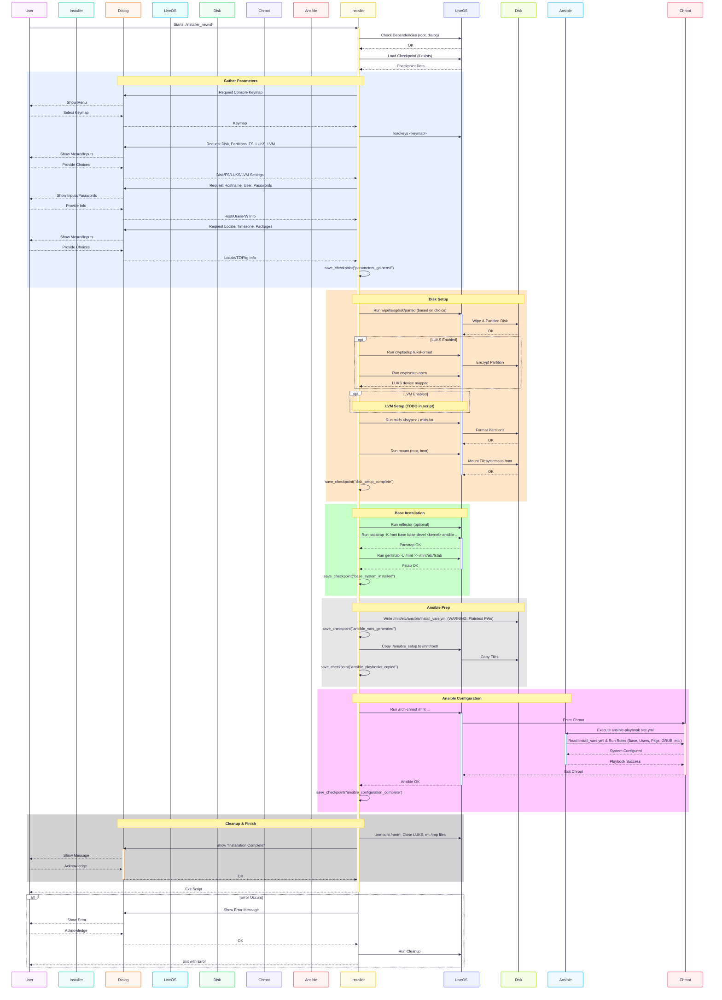

# Syncopated ISO Builder 🐧 (ArchLabs: Re-imagined)

## 🚀 Overview

This project builds a custom Arch Linux based Live/Rescue ISO named **Syncopated**. It is a continuation of the [ArchLabs](https://en.wikipedia.org/wiki/ArchLabs) project, tailored for research & development 🔬 and content generation ✍️.

The generated ISO (`syncopated*.iso`) serves as a versatile Linux Live/Rescue environment.

# SIFT Assesment 2025-05-26
## Core Assessment

  * The Syncopated project, through its ISO builder and the "Ansible Workstation Archlinux" playbook, offers a powerful two-stage process for creating a customized Arch Linux Live/Rescue ISO and subsequently provisioning a comprehensive development workstation.
  * Key strengths are the modularity of the Ansible roles (), the automation of both ISO creation and workstation setup, and the flexibility provided by supporting both `ansible-pull` and `ansible-playbook` methods ().
  * A critical ongoing concern is the `SigLevel = Optional TrustAll` setting for the custom package repository within the ISO build process, which poses a security risk that needs urgent remediation ().
  * The interdependency between the ISO's contents (e.g., included `bootstrap.sh`, Ansible version) and the Ansible playbook's requirements necessitates robust integrated testing and version management to ensure compatibility.
  * Documentation across both the ISO project and the Ansible playbook needs to be kept in sync, especially regarding repository configurations (like the removal of CachyOS) and bootstrap procedures.
  * Future development should focus on security hardening, enhancing script/playbook robustness, and potentially streamlining the workflow between ISO creation and Ansible provisioning.

## Expanded Analysis

**What is the stated goal or problem this system/component addresses?**
The overarching goal of the Syncopated project is to provide a complete solution for deploying a highly customized, development-focused Arch Linux workstation. This is achieved in two main stages: first, the Syncopated ISO Builder creates a versatile Live/Rescue ISO based on Arch Linux, serving as a bootable medium and an initial installation base (). Second, the "Ansible Workstation Archlinux" playbook is used to automate the extensive configuration of this base system into a fully operational development environment (). This playbook covers a wide range of setup tasks including base system utilities, shell customization (zsh, kitty), desktop environment (i3, X11 components), containerization (Docker), virtualization (Libvirt), development tools (Ruby, Go, Fabric), professional audio setup, networking, and security (firewalld, SSH) (). The system caters to users who require a reproducible, automated, and deeply customized Arch Linux setup, particularly for R\&D and content creation.

**What are the key strengths of the current design/proposal?**
The primary strength of the Syncopated ecosystem is its **comprehensive automation and modularity**. The Ansible playbook's role-based structure () makes the complex task of workstation setup manageable, maintainable, and customizable. The support for both `ansible-pull` (via `bootstrap.sh` from the ISO) and standard `ansible-playbook` offers deployment flexibility (). The ISO builder itself provides a solid, Arch-based foundation with features like Chaotic AUR integration () and multiple boot modes (). The detailed professional audio setup within the Ansible playbook is a unique and significant strength for users in that domain (). The project's lineage as a spiritual successor to ArchLabs also provides a conceptual starting point, while its tooling represents a modern approach ().

**What are the primary concerns or weaknesses identified?**
The **interdependency and potential for desynchronization** between the ISO build (managed by `mkarchiso` and `profiledef.sh`) and the Ansible playbook (`main.yml`/`playbooks/full.yml`) is a significant concern. The ISO must provide a stable environment and the correct tools (e.g., Ansible version, Git) for the playbook to execute reliably. The **security vulnerability** of `SigLevel = Optional TrustAll` in the ISO's custom package repository () remains a critical weakness that undermines the security of the entire system. The **complexity** of the Ansible playbook, with its numerous roles and variables (), while a strength in terms of features, also presents a challenge for testing and maintenance. **Error handling in the `bootstrap.sh` script** () needs to be very robust to manage the transition from ISO to Ansible provisioning. Keeping documentation aligned across potentially two project structures (ISO builder and Ansible playbook repo) is also a challenge.

**What are the major risks associated with this system/component or proposal?**

  * **Security Compromise:** The `SigLevel = Optional TrustAll` setting for the ISO's custom repository could allow malicious packages onto the base system, which then a fully privileged Ansible playbook would run on (). (Security Vulnerability)
  * **Deployment Failures:** Incompatibilities between the ISO version/contents and the Ansible playbook version could lead to failures during the `bootstrap.sh` execution or Ansible run (). (Integration Risk)
  * **Maintenance Complexity:** The broad scope of the Ansible playbook implies a significant testing and maintenance effort to ensure all roles function correctly individually and together across updates (). (Maintenance Risk)
  * **Upstream Dependency Breakage:** Changes in Arch Linux, Chaotic AUR, or any external Ansible roles (if adopted) could break the ISO build or the playbook. (Dependency Risk)
  * **Incomplete Features:** Stated minimal support for `lightdm` () might lead to user dissatisfaction or an incomplete desktop option if not managed or clearly communicated. (Functional Risk)

**What recommendations are made to address concerns and mitigate risks?**

  * **Mandatory Package Signing (ISO Repo):** Immediately implement package signing for the custom `[syncopated]` repository used in the ISO build and enforce signature checks.
  * **Integrated CI/CD Testing:** Develop a CI/CD pipeline that builds the ISO, deploys it to a VM, executes `bootstrap.sh`, and then runs the full Ansible playbook to verify end-to-end integrity and compatibility between components.
  * **Version Pinning/Tagging Strategy:** Implement clear versioning for both the ISO and the Ansible playbook. The `bootstrap.sh` should ideally pull a specific, tested-compatible tag or branch of the Ansible playbook repository.
  * **Ansible Playbook Best Practices:** Continue to refine the Ansible playbook with linting (e.g., `ansible-lint`), testing (e.g., Molecule for roles), and clear documentation for all variables and role dependencies.
  * **Enhanced Bootstrap Script:** Make `bootstrap.sh` more fault-tolerant, with checks for prerequisites (Ansible, Git on the installed system) and clearer error reporting.

**What is the larger architectural or project context?**

  * Arch Linux Ecosystem
  * Custom Linux ISO Building (`mkarchiso`)
  * Post-installation Configuration Management (Ansible)
  * Infrastructure as Code (IaC) for Workstation Setup
  * Live/Rescue System as a Provisioning Base
  * GitLab CI/CD Automation
  * AUR Integration (Chaotic AUR, paru)
  * Virtual Machine Testing
  * System Bootstrapping (`ansible-pull`)
  * Desktop Environment Customization (i3wm, X11, Theming)
  * Specialized Setups (Professional Audio, Development Tools)

-----

**Generated 5/26/2025, 4:16:52 AM EDT, represents a snapshot; system/code may evolve.**
**AI-Generated: Will likely contain errors or overlook nuances; treat this as one input into a human-reviewed development process**

## ✅ Verified Specifications/Components

| Specification/Component | Status | Clarification & Details | Confidence (1–5) |
|----------|----------|----------|----------|
| Project encompasses an ISO builder and a companion Ansible playbook for workstation setup | ✅ Confirmed | ISO (`Syncopated`) for base, Ansible (`Ansible Workstation Archlinux`) for full config. () | 5 |
| Ansible playbook features include base system, shell, containerization, DE (i3), dev tools, networking, pro audio | ✅ Confirmed | Extensive feature set outlined in Ansible README. () | 5 |
| ISO's `bootstrap.sh` initiates Ansible playbook execution | ✅ Confirmed | `bootstrap.sh` clones a repo and runs Ansible; Ansible README details `ansible-pull`. () | 5 |
| Package management includes pacman, paru, and repositories like `archaudio`, `chaotic-aur` (via Ansible) | ✅ Confirmed | Specified in Ansible `base` role features. () | 5 |
| Build process for ISO uses `mkarchiso`, potentially with Ansible/CI/CD | ✅ Confirmed | Described in ISO project's README. () | 5 |
| Ansible playbook uses a modular role-based structure and supports tags/variables for customization | ✅ Confirmed | Detailed in Ansible README. () | 5 |
| Professional Audio setup is a specialized feature of the Ansible playbook | ✅ Confirmed | Includes JACK, PipeWire options, low-latency tuning. () | 5 |
| ISO project provides a custom local package repository (`syncopated`) | ✅ Confirmed | Details in ISO project's `repository/README.md`. () | 5 |
| **(Previous Info)** CachyOS integration removed | ✅ Confirmed | Confirmed by user in prior iteration; Ansible README does not list CachyOS. | 5 |

## ⚠️ Identified Issues, Risks & Suggested Improvements

| Item (Code/Design/Requirement) | Issue/Risk Type | Description & Suggested Improvement | Severity (1–5) |
|----------|----------|----------|----------|
| **(ISO Project)** Custom repository: `SigLevel = Optional TrustAll` () | 🛡️ Security Vulnerability | **CRITICAL:** Allows unsigned packages in ISO base. **Suggested Improvement:** Implement package signing for the ISO's custom repository and enforce signature checks. | 5 |
| ISO & Ansible Playbook Synchronization | 🚧 Risk / 🧩 Design Flaw | Risk of incompatibility between ISO base and Ansible playbook expectations. **Suggested Improvement:** Implement integrated CI/CD testing of the full workflow (ISO build -\> install -\> Ansible run). Version-lock or clearly document compatible ISO/playbook versions. | 4 |
| `bootstrap.sh`: Robustness & Prerequisite Handling () | 🐛 Bug / 🚧 Risk | `bootstrap.sh` may fail if Ansible/Git are not on the base system or if errors occur during playbook initiation. **Suggested Improvement:** Ensure `bootstrap.sh` checks for/installs Ansible & Git on the target system. Add comprehensive error checking for each step. | 3 |
| Ansible Playbook Complexity () | 🚧 Risk | Large number of roles increases maintenance and testing surface. **Suggested Improvement:** Rigorous per-role testing (e.g., Molecule) and end-to-end testing. Clear documentation for inter-role dependencies. | 3 |
| Documentation Consistency | ❓Ambiguity | Discrepancies or outdated information across ISO README, Ansible README, and actual configurations (e.g., CachyOS removal). **Suggested Improvement:** Regular audit and synchronization of all documentation. | 3 |
| Minimal `lightdm` Role () | ❓Ambiguity | Functionality and purpose of the minimal LightDM setup is unclear. **Suggested Improvement:** Complete the role or clearly document its current state and intended use. | 2 |

## 📌 Issue & Improvement Summary:

  * **Critical Security (ISO Repository)**: The `SigLevel = Optional TrustAll` setting () in the ISO's custom package system is a severe security risk that needs immediate attention by implementing mandatory package signing.
  * **Integration and Versioning**: The **tight coupling between the ISO and the Ansible playbook** requires a robust strategy for versioning and integrated testing to prevent compatibility issues.
  * **Script and Playbook Reliability**: Enhancing **error handling in `bootstrap.sh`** () and ensuring the **maintainability of the extensive Ansible playbook** () through testing and documentation are crucial.
  * **Documentation Accuracy**: All project documentation needs to be **kept current and consistent**, reflecting changes like the removal of CachyOS.

## 💡 Potential Optimizations/Integrations:

| Optimization/Integration Idea | Potential Benefit | Relevant Documentation/Link | Rating (1–5) |
|---------------------------------|-------------------|-----------------------------|--------------|
| Ansible Lint & Molecule Testing for Playbook | Improved code quality, adherence to best practices, and automated role testing. | [Ansible Lint](https://www.google.com/search?q=https://proxy.pigb.top:443/https/ansible-lint.readthedocs.io/), [Molecule](https://www.google.com/search?q=https://proxy.pigb.top:443/https/molecule.readthedocs.io/) | 5 |
| Integrated ISO + Ansible CI/CD Pipeline | End-to-end testing ensuring compatibility and catching integration issues early. | N/A (Custom CI setup) | 5 |
| Offer ISO variants (e.g., minimal, with Ansible pre-cloned) | Cater to different user needs for bootstrap speed vs. ISO size. | `profiledef.sh` modifications, multiple build targets. | 3 |
| Centralized Documentation Portal | A single source of truth for both ISO and Ansible playbook aspects. | E.g., a simple static site generated from Markdown. | 4 |
| Variable Validation in Ansible | Use `assert` tasks or JSON schema validation for playbook inputs. | [Ansible Assert Module](https://www.google.com/search?q=https://proxy.pigb.top:443/https/docs.ansible.com/ansible/latest/collections/ansible/builtin/assert_module.html) | 3 |

## 🛠️ Assessment of Resources & Tools:

| Resource/Tool | Usefulness Assessment | Notes | Rating (1-5) |
|---------------|-----------------------|-------|--------------|
| **Ansible Playbook (`README.md`)** () | ✅ Core of the workstation setup. | Well-structured and comprehensive. Primary configuration driver. (Source Code - Described) | 5 |
| **Syncopated ISO Builder (`syncopated-iso/README.md`, `profiledef.sh`)** () | ✅ Foundation for the Ansible playbook. | Provides the base OS and bootstrap mechanism. (Source Code, Documentation) | 5 |
| **`bootstrap.sh`** () | ✅ Critical link between ISO and Ansible. | Its reliability is key to the two-stage process. (Source Code) | 4 |
| **ArchISO, `mkarchiso`** () | ✅ Core tool for ISO creation. | Standard and powerful. (Documentation) | 5 |
| **GitLab CI/CD** () | ✅ Enables automated ISO builds. | Essential for reproducible builds. (Expert Opinion) | 5 |
| **Chaotic AUR & archaudio** () | ✅ Enhance package availability. | Important for a feature-rich environment. (Community Input) | 4 |
| **`run_test_vm.rb`** () | ✅ Facilitates ISO testing. | Good for basic ISO boot/functionality checks. (Source Code) | 4 |

## ⚙️ Revised System/Module Overview (Incorporating Feedback):

The Syncopated project employs a robust, two-stage architecture to deliver a highly customized Arch Linux development workstation. The first stage involves the "Syncopated ISO Builder," which uses `mkarchiso` to create a bootable Live/Rescue ISO (). This ISO, as defined in `profiledef.sh` (), provides a minimal Arch Linux environment, necessary boot configurations for BIOS and UEFI (Syslinux, GRUB) (), and includes the crucial `bootstrap.sh` script (). The custom `[syncopated]` package repository is also utilized during this ISO build phase ().

The second stage commences after the system is booted from the ISO (either live or installed). The `bootstrap.sh` script is executed, which then fetches and runs the "Ansible Workstation Archlinux" playbook (). This comprehensive Ansible playbook, organized into modular roles, performs the detailed configuration of the workstation. It sets up the base system (including Chaotic AUR and archaudio repositories), shell environment (zsh, kitty), i3 desktop environment, containerization/virtualization tools (Docker, Libvirt), extensive development tools, networking services (`systemd-networkd`, `firewalld`), and a specialized professional audio environment (). This layered approach allows for a clean base ISO and highly flexible, automated, and extensive end-user system provisioning. Addressing the `SigLevel = Optional TrustAll` in the ISO's custom repository is critical for overall system security.

## 🏅 Technical Feasibility & Recommendation:

The complete Syncopated system, combining the ISO builder and the extensive Ansible playbook, is **highly technically feasible and presents a sophisticated solution** for reproducible Arch Linux workstation deployment. The chosen tools (`mkarchiso`, Ansible, Git) are well-suited for their respective tasks.

**The overarching recommendation** is to **formalize the relationship and contract between the ISO build and the Ansible playbook**. This includes rigorous integrated CI/CD testing that validates the entire pipeline from ISO build to successful Ansible playbook completion. Package signing for the ISO's custom repository must be implemented. Clear versioning compatibility between the ISO and the Ansible playbook should be documented and enforced to prevent deployment failures. The project is ambitious and powerful; focusing on these integration points and security aspects will ensure its reliability and trustworthiness.

## 📘 Development Best Practice Suggestion:

Establish a **shared "bill of materials" or interface definition** that explicitly lists the packages, tools (and their versions, like Ansible), and critical configurations the ISO guarantees to provide, which the Ansible playbook can then reliably depend on. This contract, versioned alongside the projects, helps manage interdependencies.

## 🙏 Contributing

Contributions are welcome! Please feel free to submit a Pull Request.

## 📜 License

This project is licensed under the GPL-2.0 license.

